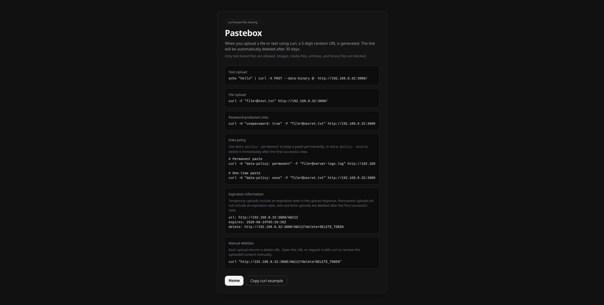
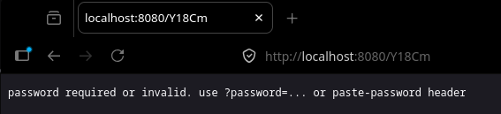
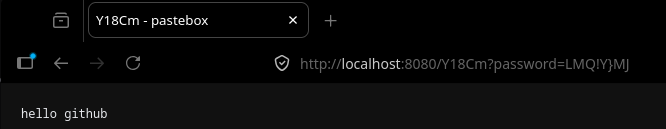

# Pastebox
curl-based file sharing service

English | [Korean](./README_ko.md)



### Tech stack
| Layer | Stack |
|--------|------|
| OS | Alpine Linux 3.23.4 (mirror: https://mirror5.krfoss.org/alpine) |
| Language | Go |
| Frontend | Go HTML Template |
| Backend | Go Standard Library HTTP Server |
| Storage | Local File Storage |

*If there is a specific mirror you want to use, you can modify it in the Dockerfile.*

### Directory structure
```text
pastebox/
├── Dockerfile
├── docker-compose.yml
├── docker-entrypoint.sh
├── go.mod
├── README.md
├── README_ko.md
├── cmd/
│   └── server/
│       └── main.go
├── internal/
│   ├── metadata.go
│   └── store.go
└── templates/
    └── index.html
```

### How to use?
1. Clone the repository or download it as a .zip file.
2. Build and run using docker compose: `docker compose up -d --build`.
3. Open `http://localhost:3000` in your browser, or access the service through a reverse proxy configured with Nginx, Traefik, or Caddy.
4. Upload a file using `curl`.

### Features
> [!NOTE]
> **DON'T FORGET TO REPLACE `localhost` WITH THE DOMAIN OR IP ADDRESS YOU'RE CURRENTLY USING.**

1. **Automatic File Deletion**: Uploaded files are automatically deleted 30 days after upload.

2. **Text Upload**: You can upload text directly by combining Pastebox with Linux commands such as **echo** and **cat (cat << EOF)**.
   ```
   echo "hello" | curl -X POST --data-binary @- http://localhost:8080/
   ```

3. **File Upload**: Supports file uploads using the `multipart/form-data` format.
   ```
   curl -F "file=@test.txt" http://localhost:8080/
   ```

4. **Permanent Storage**: Use the `data-policy: permanent` header to exclude an uploaded file from automatic deletion and store it permanently.
   ```
   curl -H "data-policy: permanent" -F "file=@test.txt" http://localhost:8080/
   ```
   ```json
   // Storage path: ./data/code.json

   {
     "id": "code",
     "created_at": "2026-05-25T06:46:51.108540924Z",
     "expires_at": "0001-01-01T00:00:00Z",
     "data_policy": "permanent",
     "size": 5,
     "content_type": "application/octet-stream"
   }
   ```

5. **One-time storage**: When the `data-policy: once` header is used, the data is stored only once and is automatically deleted once the user has confirmed it.
   ```
   curl -H "data-policy: once" -F "file=@test.txt" http://localhost:8080/
   ```
   ```json
   {
    "id": "code",
    "delete_token_hash": "yourDeleteToken",
    "created_at": "2026-05-26T11:11:09.799454368Z",
    "expires_at": "2026-06-25T11:11:09.799454368Z",
    "data_policy": "once",
    "size": 6,
    "content_type": "text/plain; charset=utf-8"
   }
   ```

6. **Expiration Information**: Temporary uploads include an `expires` field in the response so you can check when the file will expire. If `data-policy: permanent` is used, the expiration date is not shown.
   ```
   url: http://localhost:8080/RANDOM_CODE
   expires: 2026-06-24T05:10:26Z
   delete: http://localhost:8080/RANDOM_CODE?delete=DELETE_TOKEN
   ```

7. **Manual Deletion**: Each upload returns a delete URL. You can use this URL to manually delete the uploaded file. Deletion requests are also recorded in the container logs.
   ```
   # Delete file
   curl "http://localhost:8080/RANDOM_CODE?delete=DELETE_TOKEN"
   ```
   ```
   deleted
   ```

8. **Password-Protected Links**: Supports private upload links using the `usepassword: true` header.

   When this header is used, an 8-character password is generated using a combination of uppercase letters, lowercase letters, numbers, and special characters. Files can be accessed using either the `?password=...` query parameter or the `paste-password: ...` header.
   ```
   # Create password-protected link
   curl -H "usepassword: true" -F "file=@secret.txt" http://localhost:8080/

   # View file: header method
   curl -H "paste-password: RANDOM_PASSWORD" http://localhost:8080/RANDOM_CODE

   # View file: query parameter method
   curl "http://localhost:8080/RANDOM_CODE?password=RANDOM_PASSWORD"
   ```

   
   

9. **Upload Response Format**: When an upload succeeds, Pastebox returns the URL, expiration time, and delete link. If the upload is password-protected, the `password` field is also included.
   ```
   url: http://localhost:8080/RANDOM_CODE
   expires: 2026-06-24T05:10:26Z
   password: RANDOM_PASSWORD
   delete: http://localhost:8080/RANDOM_CODE?delete=DELETE_TOKEN
   ```

10. **Copy Content in Browser**: When opening a text-based upload link in the browser, you can copy the content to your clipboard using the `Copy` button next to the `Raw` button.

11. **Text File Rendering in Browser**: Text-based files such as `.txt` and `.log` are displayed directly in the browser instead of being downloaded. If you need the original raw response, use `?raw=1`.

12. **Creation and Deletion Logs**: File creation and deletion events are recorded in the container logs.
   ```
   created: id=AbC12 remote=127.0.0.1:51234 size=123 content_type="text/plain; charset=utf-8" policy=temporary expires=2026-06-24T05:10:26Z protected=false
   deleted: id=AbC12 remote=127.0.0.1:51234
   ```

13. **Fine-Grained Lock Manager**: Pastebox applies locks per upload ID to reduce conflicts when viewing, deleting, or cleaning up the same file concurrently. Different files can still be processed in parallel.

14. **Admin Page**: You can access the admin page by adding `/admin` after the IP address or domain. If no account exists, the first created account becomes the administrator account, and additional account creation is disabled afterward. The admin database is stored at `/paste-data/pastebox.db` inside the container, or `./data/pastebox.db` on the host. Passwords are stored in encrypted form.
